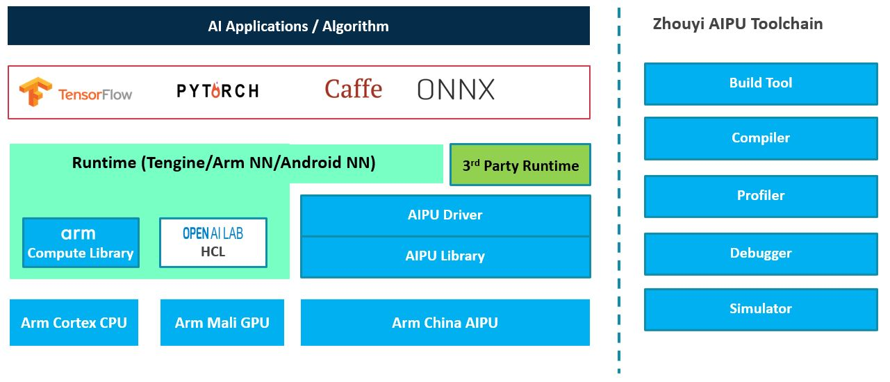

## Zhouyi Model Zoo

This repo provides a set of AI models for reference used by Zhouyi SDK.

Each model provides configuration file for build tool/NN-compiler usage, and min/max file for quantization usage.

>**Note**: For all the models listed as below, this repo provides frozen model in SFTP server besides original link. Some models don't have TFLite version or ONNX version link, as they are converted from TensorFlow/Caffe.

&nbsp;

### Classification
- [Alexnet](https://github.com/tensorflow/models/tree/archive/research/slim/nets)
- Resnet-v1-50
  > [TF model](https://github.com/tensorflow/models/tree/archive/research/slim/nets),
    [Caffe model](https://github.com/SnailTyan/caffe-model-zoo)
- [Resnet-v2-50](https://github.com/tensorflow/models/tree/master/research/slim#Pretrained)
- Resnet-v1-101
  > [TF model](https://github.com/tensorflow/models/tree/archive/research/slim/nets),
    [Caffe model](https://github.com/SnailTyan/caffe-model-zoo)
- [Resnet-v2-101](https://github.com/soeaver/caffe-model)

- [Resnet-v1-152](https://github.com/tensorflow/models/tree/master/research/slim#Pretrained)
- [Resnet-v2-152](https://github.com/tensorflow/models/tree/master/research/slim#Pretrained)

- [Resnext-50](https://github.com/soeaver/caffe-model)

- VGG-16
  > [TF model](https://github.com/tensorflow/models/tree/archive/research/slim/nets),
  [Caffe model](https://gist.github.com/ksimonyan/211839e770f7b538e2d8#file-readme-md)

- [VGG-19](https://github.com/tensorflow/models/tree/master/research/slim#Pretrained)

- [Inception-v1](https://github.com/tensorflow/models/tree/master/research/slim#Pretrained)
- Inception-v3
  > [TF model](https://github.com/tensorflow/models/tree/archive/research/slim/nets),
    [Caffe model](https://github.com/soeaver/caffe-model/tree/master/cls)
- Inception-v4
  > [TF model](https://github.com/tensorflow/models/tree/archive/research/slim/nets),
    [Caffe model](https://github.com/soeaver/caffe-model/tree/master/cls)
- [Inception-ResNet-v2](https://github.com/tensorflow/models/tree/master/research/slim#Pretrained)
- [Xception](https://github.com/soeaver/caffe-model)
- Mobilenet-v1
  > [TF model](https://github.com/tensorflow/models/tree/master/research/slim#Pretrained),
  [Caffe model](https://github.com/shicai/MobileNet-Caffe)
- Mobilenet-v2
  > [TF model](https://github.com/tensorflow/models/tree/archive/research/slim/nets/mobilenet),
  [Caffe model](https://github.com/shicai/MobileNet-Caffe)

- [Squeezenet](https://github.com/forresti/SqueezeNet)

- Shufflenet-v2
  > [TF model](https://github.com/TropComplique/shufflenet-v2-tensorflow),
  [Caffe model](https://github.com/Ewenwan/ShuffleNet-2)

- [Densenet-169](https://github.com/soeaver/caffe-model)
- [DPN68-extra](https://github.com/soeaver/caffe-model)
- [DPN92](https://github.com/soeaver/caffe-model)
- [Peleenet](https://github.com/Robert-JunWang/PeleeNet/tree/master/caffe)

### Detection
- Mobilenet-v1-SSD
- Mobilenet-v2-SSD
  > [TF model](https://github.com/tensorflow/models/tree/archive/research/object_detection/models),
  [Caffe model](https://github.com/chuanqi305/MobileNet-SSD)
- [VGG-SSD](https://github.com/weiliu89/caffe/tree/ssd)

- YOLO-v2
  > [TF model](https://github.com/wojciechmo/yolo2),
  [Caffe model](https://github.com/tsingjinyun/caffe-yolov2)

- [YOLO-v3](https://github.com/foss-for-synopsys-dwc-arc-processors/synopsys-caffe-models/tree/master/caffe_models/yolo_v3)

- Faster R-CNN
  > [TF model](http://download.tensorflow.org/models/object_detection/faster_rcnn_resnet50_coco_2018_01_28.tar.gz),
   [Caffe model](https://github.com/rbgirshick/py-faster-rcnn)
- [MTCNN](https://github.com/CongWeilin/mtcnn-caffe)

### Segmentation
- [FCN](https://github.com/shelhamer/fcn.berkeleyvision.org/tree/master/voc-fcn8s-atonce)
- [Deeplab-v3](https://github.com/tensorflow/models/tree/archive/research/deeplab)
- UNet
- [ENet](https://github.com/TimoSaemann/Enet)
- [ICNet](https://github.com/hszhao/ICNet)
- [ERFNet](https://github.com/Yuelong-Yu/ERFNet-Caffe)

### Super-resolution
- ESPCN

### Speech
- [KWS-GRU](https://github.com/ARM-software/ML-KWS-for-MCU)
- [Deepspeech-v2](https://github.com/tensorflow/models/tree/archive/research/deep_speech)
- [Wavenet](https://github.com/buriburisuri/speech-to-text-wavenet)       

&nbsp;

#### **FTP model download (Suggest FTP tool [FileZilla](https://filezilla-project.org/))**
  - `Host`: sftp://sftp01.armchina.com
  - `Account`:  zhouyi.armchina
  - `Password`:   114r3cJd 

&nbsp;

## About Zhouyi NPU
Zhouyi NPU IP is a high efficiency and high performance AI processor that supports wide range of AI application, including vision, audio/speech and NLP. Zhouyi NPU offers fixed function accelerator that speeds up general operations like convolution and activation, meanwhile Zhouyi NPU offers flexible programmability to support new operations or customized operations.

Zhouyi NPU IP has been deployed in a number of market segments, including surveillance, automotive, IOT, etc. With proven peformance and scalablility, Zhouyi NPU IP covers 0.25TOPS to hunders of TOPS, target market from edge computing to data center.

&nbsp;

## About Zhouyi SDK
Zhouyi SDK is a full stack of platform that provides fast time-to-market development and deployment capability for user. 

### Highlighted feature:
- Support various framework
  > Supports TensorFlow, TensorFlow Lite, Caffe, Pytorch and ONNX, extend to support orther framework by IR transition

- Graph optimization
  > Many graph optimization techniques are used to reduce network complexity, like conv+batchnorm+relu fusion, to make graph run fast and efficiently on Zhouyi hardware. 

- Quantization
  > Support training-aware quantization model and post-training quantization method. Natively provides advanced-quantization techniques, also provide interface for user customized quantization parameter.

- IR (intermediate representation)
  > Public Zhouyi IR, and can be a standard for other framework to support

- Customization
  > Provide plugin interface for user easy to develop custom operations and integrate into SDK

- Simulator 
  > Provide instruction-level simulator, easy for user to evaluate model before porting to hardware
